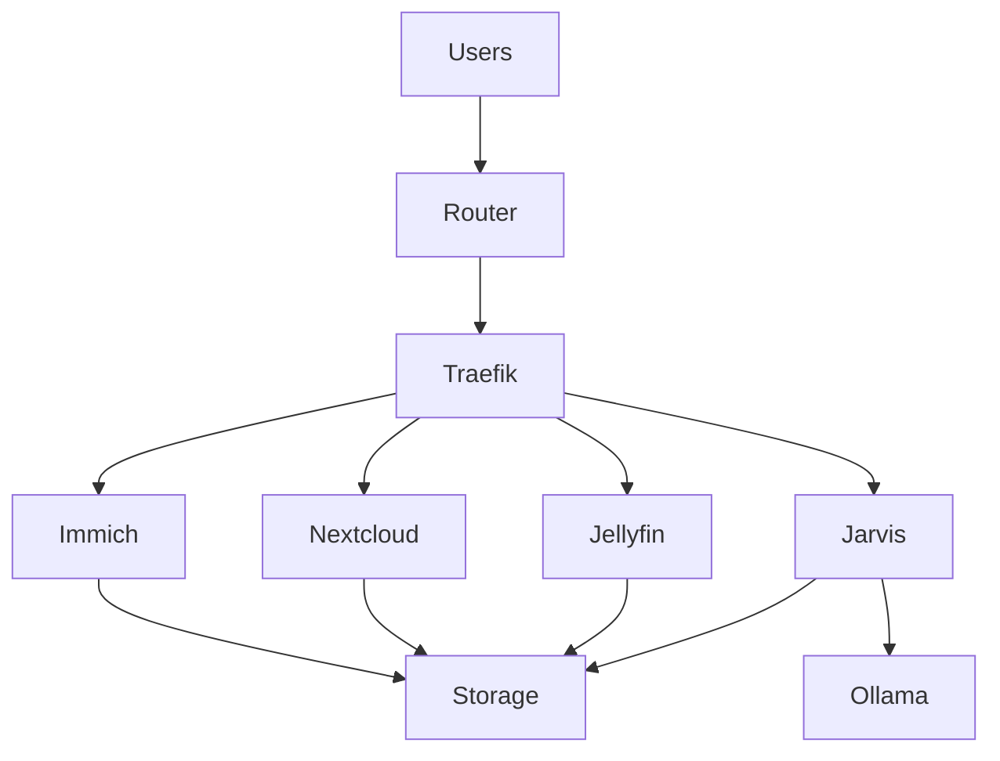

# Jarvis Home Server — System Diagram

This diagram shows the basic architecture of the Jarvis Home Server.

---

## System Architecture



---

## Components

**Users**
- PC
- Phone
- Tablet

**Router**
- Home network gateway

**Traefik**
- Reverse proxy
- Routes traffic to services

**Services**
- Immich — photo server
- Nextcloud — personal cloud
- Jellyfin — media server
- Jarvis — AI interface

**AI Layer**
- Ollama — local LLM models

**Storage**
- RAID array mounted at `/data`

---

## Storage Layout

```
/data
├── photos
├── media
├── documents
└── cloud
```

---

## Network Access

Example service URLs:

```
immich.aiserver.local
cloud.aiserver.local
jarvis.aiserver.local
```

All services are routed through **Traefik**.
